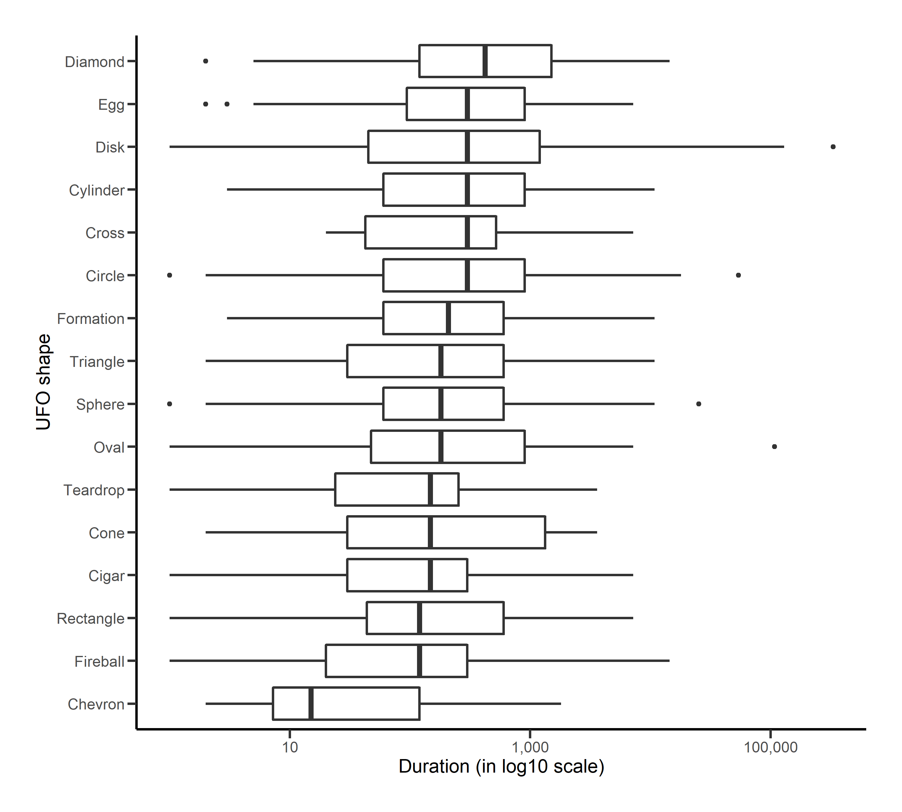
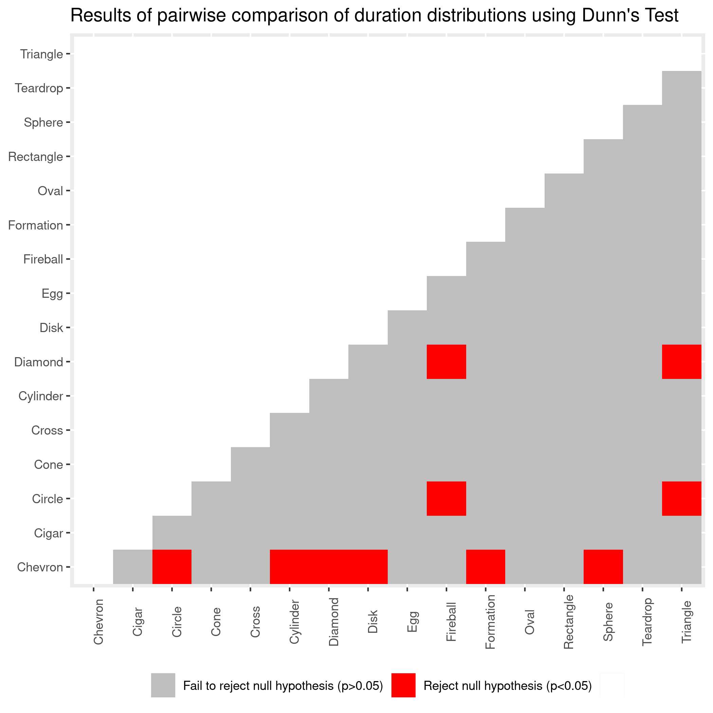

UFO Report
================
Group-20 DSCI-522
11/28/2020

# Summary

# Introduction

Unidentified flying objects (UFOS) have a long and somewhat contentious
history. Contrary to popular belief, most sightings are actually honest
mistakes and not hoaxes. Weather balloons, satellites, and other
explicable phenomena account for the vast majority of sightings. We
wondered if these different phenomenon might leave traces in the data.
Suspecting that different causes would be associated with different
shapes of UFO reported in the sighting, we thought that these different
causes might lead to different duration of sightings in our home areas
of Washington and British Columbia.

## Data

To test our hypothesis, we selected the dataset UFO sightings maintained
by National UFO Reporting Center (NUFORC). The data is submitted by
users and in the majority of cases presented in the users’ own words.
For analysis, we have selected reports made in British Columbia, Canada
and Washington State, USA before 11/18/2020. There are 4710 observations
and 7 features in the data set.

### Data Processing and Methods

Data was analyzed using both the R programming language (R Core Team
2019) and Python (Van Rossum and Drake 2009). Packages utilized in
analysis as well as report generation include the Tidyverse package
(Wickham 2017), docopt for both Python and R (de Jonge 2018; Keleshev
2014), as well as knitr (Xie 2014).

Text reports of sightings were converted to seconds. We removed
sightings that had approximate times or provided a range of times for
example: `still here`, `seconds`, `unknown`, `some minutes`. Reports
that did not specify any shape or specified something other than shape,
for example `Flash`, `Light`, `Unknown`, `Other`, `Changing`, were
removed. We also applied a log-transform to the duration of sightings in
seconds to aid in visualizing our data. The final data used in the
analysis has 3287 observations.

## Analysis

**Hypothesis**

-   *H*0 The mean ranks of the duration of sightings for all
    shapes are equal.

-   *H**A* The mean ranks of the duration of sightings for
    all shapes are not equal.

We took a non-parametric approach because of differences in group size,
skewed distribution, and variance between the different duration of
different shapes. We selected the Kruskal-Wallis H Test to test to
determine if significant differences existed. Dunn’s test was utilized
for Post-Hoc analysis with Bonferroni’s correction to identify pairs of
groups whose median population duration are significantly different. We
selected a significance level of *α* = 0.05 for both steps in testing.

# Results & Discussion

**EDA** 

**Kruskal Wallis H Test**

| Model          | p-value      |
|:---------------|:-------------|
| Kruskal-Wallis | 1.127997e-15 |

Table 1. Kruskal Wallis H Test Test Results

**P value of significant pairs from Dunn Test**

| Comparison         | Adjusted p-value |
|:-------------------|-----------------:|
| Chevron-Changing   |        0.0000003 |
| Cigar-Changing     |        0.0010571 |
| Fireball-Changing  |        0.0000002 |
| Flash-Changing     |        0.0000000 |
| Light-Changing     |        0.0000480 |
| Other-Changing     |        0.0001372 |
| Oval-Changing      |        0.0021063 |
| Rectangle-Changing |        0.0218084 |
| Sphere-Changing    |        0.0043261 |
| Triangle-Changing  |        0.0000047 |
| Circle-Chevron     |        0.0022751 |
| Cylinder-Chevron   |        0.0423478 |
| Diamond-Chevron    |        0.0002562 |
| Disk-Chevron       |        0.0110568 |
| Formation-Chevron  |        0.0350615 |
| Sphere-Chevron     |        0.0389912 |
| Unknown-Chevron    |        0.0007316 |
| Fireball-Circle    |        0.0019728 |
| Flash-Circle       |        0.0000506 |
| Flash-Cylinder     |        0.0169898 |
| Fireball-Diamond   |        0.0050994 |
| Flash-Diamond      |        0.0000272 |
| Triangle-Diamond   |        0.0392916 |
| Flash-Disk         |        0.0010800 |
| Unknown-Fireball   |        0.0008355 |
| Formation-Flash    |        0.0062859 |
| Light-Flash        |        0.0140917 |
| Oval-Flash         |        0.0450082 |
| Sphere-Flash       |        0.0042789 |
| Unknown-Flash      |        0.0000154 |
| Unknown-Triangle   |        0.0274631 |

Table 2. Shape pairs with significant difference in mean ranks

**Post-Hoc Analysis Result**

Ultimately, our testing revealed several significant differences in mean
rank of duration of sightings between shapes. Further experimentation
would be necessary to determine the underlying cause(s) of the
differences.

Additionally, there are some important limitations to this work. As
discussed in previous sections we removed a good deal of data in
processing. There is potential that we somehow introduced a bias into
our results through this process. Furthermore, our sample was not random
or representative of all UFO sightings in the BC and Washington area
because we only had access to samples that were reported.

# References

de Jonge, Edwin. 2018. *Docopt: Command-Line Interface Specification
Language*. <https://CRAN.R-project.org/package=docopt>.

Keleshev, Vladimir. 2014. *Docopt: Command-Line Interface Description
Language*. <https://github.com/docopt/docopt>.

R Core Team. 2019. *R: A Language and Environment for Statistical
Computing*. Vienna, Austria: R Foundation for Statistical Computing.
<https://www.R-project.org/>.

Van Rossum, Guido, and Fred L. Drake. 2009. *Python 3 Reference Manual*.
Scotts Valley, CA: CreateSpace.

Wickham, Hadley. 2017. *Tidyverse: Easily Install and Load the
’tidyverse’*. <https://CRAN.R-project.org/package=tidyverse>.

Xie, Yihui. 2014. “Knitr: A Comprehensive Tool for Reproducible Research
in R.” In *Implementing Reproducible Computational Research*, edited by
Victoria Stodden, Friedrich Leisch, and Roger D. Peng. Chapman;
Hall/CRC. <http://www.crcpress.com/product/isbn/9781466561595>.

